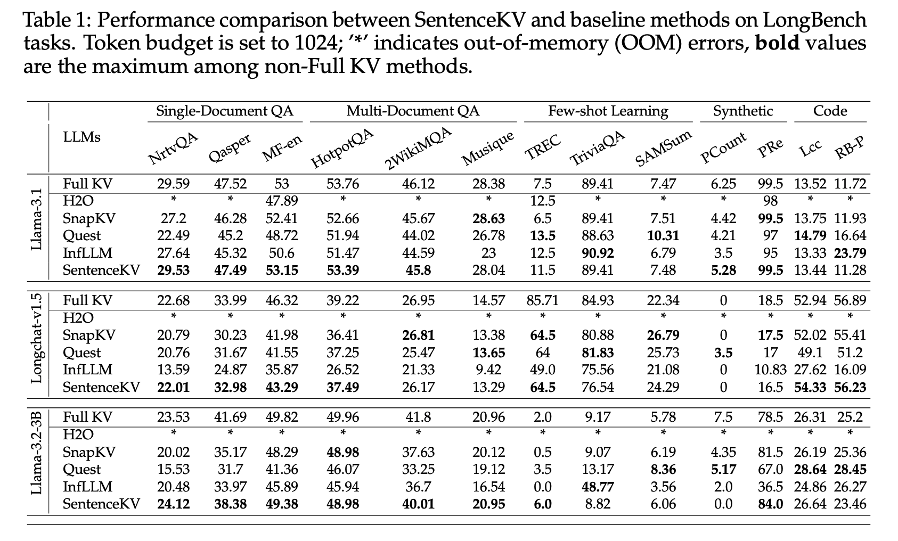
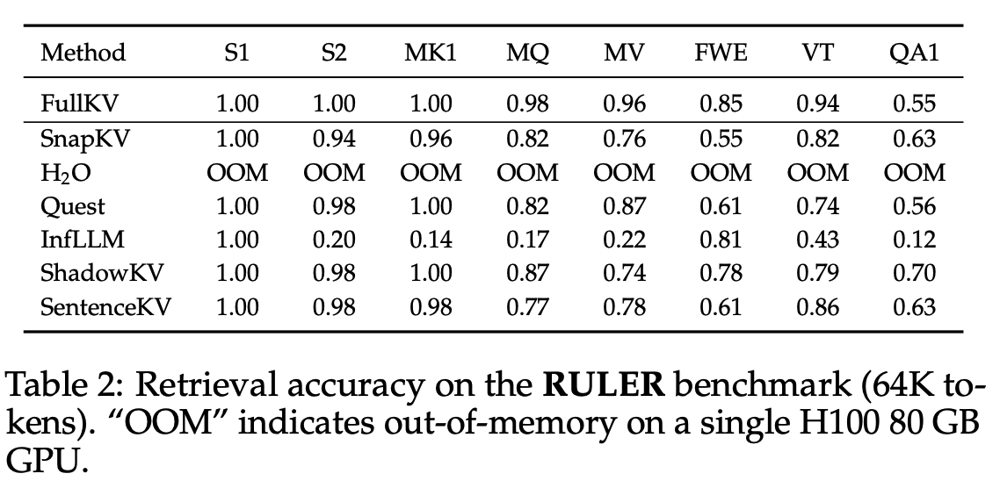

# SentenceKV: Efficient LLM Inference via Sentence-Level Semantic KV Caching

[](https://arxiv.org/abs/2504.00970)
[](https://colmweb.org/)

Official implementation of **["SentenceKV: Efficient LLM Inference via Sentence-Level Semantic KV Caching"](https://arxiv.org/abs/2504.00970)** (COLM 2025).

## Overview

SentenceKV is an efficient KV cache compression method that organizes the KV cache at the sentence level based on semantic similarity. Unlike token-level compression methods, SentenceKV leverages the natural structure of language by clustering semantically similar sentences and maintaining a compact cache that preserves important contextual information.

<div align="center">
  
  <p><em>Overview of the SentenceKV method</em></p>
</div>

### Key Features

- **Sentence-level Organization**: Groups tokens into semantic sentences for more effective compression
- **Semantic Clustering**: Uses semantic similarity to determine which sentences to retain in the cache
- **Efficient Inference**: Maintains inference quality while significantly reducing memory usage
- **Plug-and-play**: Easy integration with existing transformer models

## Installation

### Environment Setup

1. Clone the repository:
```bash
git clone https://github.com/zzbright1998/SentenceKV.git
cd SentenceKV
```

2. **Option A: Using Conda (Recommended)**
```bash
conda env create -f environment.yml
conda activate sentencekv
```

3. **Option B: Using pip**
```bash
# Create a virtual environment (optional but recommended)
python -m venv venv
source venv/bin/activate  # On Windows: venv\Scripts\activate

# Install PyTorch first (adjust CUDA version as needed)
pip install torch torchvision torchaudio --index-url https://download.pytorch.org/whl/cu124

# Install other dependencies
pip install -r requirements.txt
```

4. **Option C: Manual Installation**
```bash
# Create a new conda environment
conda create -n sentencekv python=3.10
conda activate sentencekv

# Install PyTorch (adjust CUDA version as needed)
conda install pytorch torchvision torchaudio pytorch-cuda=12.4 -c pytorch -c nvidia

# Install core dependencies
pip install transformers>=4.44.0 accelerate>=1.0.0 datasets>=3.0.0
pip install flash-attn>=2.6.0 # For efficient attention computation
pip install evaluate rouge-score nltk scikit-learn # For evaluation metrics
pip install numpy pandas tqdm pyyaml requests # Basic utilities
```

**Requirements:**
- Python 3.10+
- CUDA-compatible GPU (recommended)
- At least 16GB GPU memory for 7B models


## Usage

### LongBench Evaluation

To run experiments on LongBench datasets:

1. Navigate to the LongBench directory:
```bash
cd SentenceKV/LongBench
```

2. Configure and run the evaluation:
```bash
./run_longbench.sh
```

The script supports multiple configurations:
- **Models**: Various LLaMA models (3.2-3B, Llama-3.1-8B, etc.)
- **Methods**: SentenceKV, FullKV, SnapKV, H2O, Quest
- **Datasets**: narrativeqa, qasper, multifieldqa_en, hotpotqa, 2wikimqa, musique, gov_report, qmsum, multi_news, trec, triviaqa, samsum, passage_count, passage_retrieval_en, lcc, repobench-p
- **Cache Capacities**: Configurable KV cache sizes

3. Evaluate results:
```bash
./metrics.sh path/to/results (e.g. SentenceKV/LongBench/results_long_bench/MODEL_NAME)
```

### RULER Evaluation

To run experiments on RULER benchmark:

1. Navigate to the RULER directory:
```bash
cd SentenceKV/RULER
```

2. Configure and run the evaluation:
```bash
./run_ruler.sh 
```

The script supports:
- **Context Lengths**: 16K, 32K, 65K tokens
- **Datasets**: NIAH (single/multi), VT, FWE, QA tasks
- **Methods**: SentenceKV and baseline methods

3. Evaluate results:
```bash
./metrics.sh path/to/results (e.g. SentenceKV/RULER/results_ruler/MODEL_NAME)
```

### Custom Integration

You can integrate SentenceKV into your own projects:

```python
from models.sentencekv.custom_llama_sentencekv import LlamaForCausalLM
from transformers import LlamaTokenizer

# Load model and tokenizer
model = LlamaForCausalLM.from_pretrained("meta-llama/Llama-3.1-8B-Instruct")
tokenizer = LlamaTokenizer.from_pretrained("meta-llama/Llama-3.1-8B-Instruct")

# Configure SentenceKV parameters
model.config.max_capacity_prompts = 1024  # Cache capacity
model.config.semantic_factor = 3  # Semantic clustering factor

# Use the model for inference
inputs = tokenizer("Your input text here", return_tensors="pt")
outputs = model.generate(**inputs, max_new_tokens=100)
```

## Configuration

### Key Parameters

- `max_capacity_prompts`: Maximum number of tokens to keep in the KV cache
- `semantic_factor`: Controls the granularity of semantic clustering
- `attn_implementation`: Attention implementation ("flash_attention_2" recommended)

### Supported Methods

- **SentenceKV**: Our proposed sentence-level semantic KV caching
- **FullKV**: Full KV cache (baseline)
- **SnapKV**: Token-level KV cache compression
- **H2O**: Heavy-hitter oracle KV caching
- **Quest**: Query-aware sparse transformer

## Results

SentenceKV demonstrates significant improvements in:
- **Memory Efficiency**: Reduced KV cache memory usage
- **Inference Speed**: Faster generation with compressed cache
- **Quality Preservation**: Maintains performance on long-context tasks

### Experimental Results

<div align="center">
  
  <p><em>Performance comparison on LongBench datasets</em></p>
</div>

<div align="center">
  
  <p><em>Performance comparison on RULER benchmark</em></p>
</div>

Detailed results are available in our [paper](https://arxiv.org/abs/2504.00970).

## File Structure

```
SentenceKV/
├── README.md
├── environment.yml
├── LongBench/                 # LongBench evaluation
│   ├── run_longbench.py
│   ├── run_longbench.sh
│   ├── metrics.py
│   ├── metrics.sh
│   └── data/                  # Evaluation datasets
├── RULER/                     # RULER evaluation
│   ├── run_ruler.py
│   ├── run_ruler.sh
│   ├── metrics.py
│   ├── metrics.sh
│   └── data/                  # RULER datasets
├── NIAH/                      # Needle in a Haystack evaluation
├── models/
│   ├── sentencekv/           # Core SentenceKV implementation
│   ├── pyramidkv/            # PyramidKV baseline
│   ├── quest/                # Quest baseline
│   └── inf_llm/              # InfLLM baseline
```

## Citation

If you find SentenceKV useful in your research, please cite our paper:

```bibtex
@article{zhu2025sentencekv,
  title={SentenceKV: Efficient LLM Inference via Sentence-Level Semantic KV Caching},
  author={Zhu, Yuxuan and Falahati, Ali and Yang, David H and Amiri, Mohammad Mohammadi},
  journal={arXiv preprint arXiv:2504.00970},
  year={2025}
}
```

## License

This project is licensed under the MIT License - see the LICENSE file for details.

